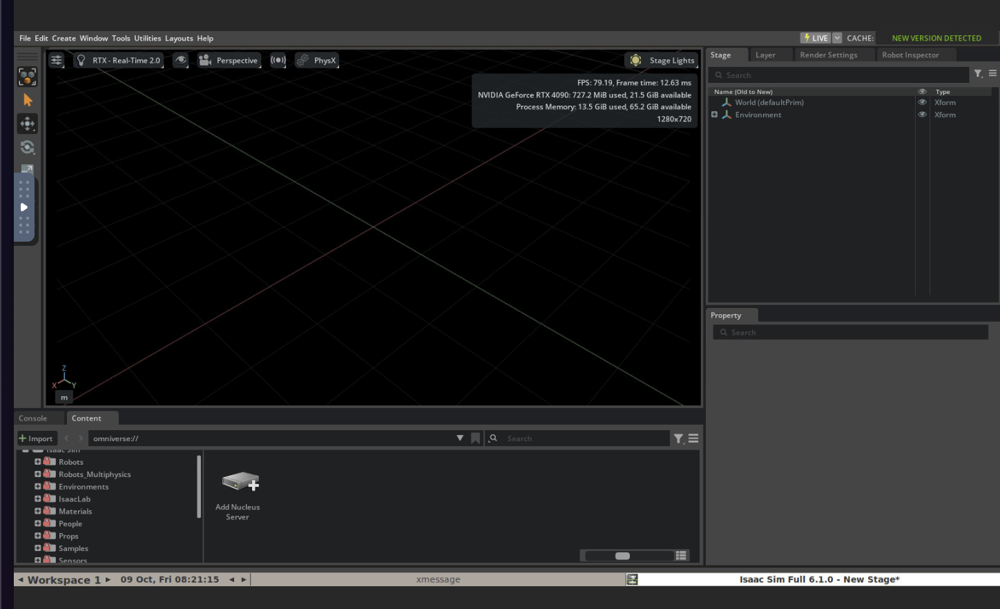
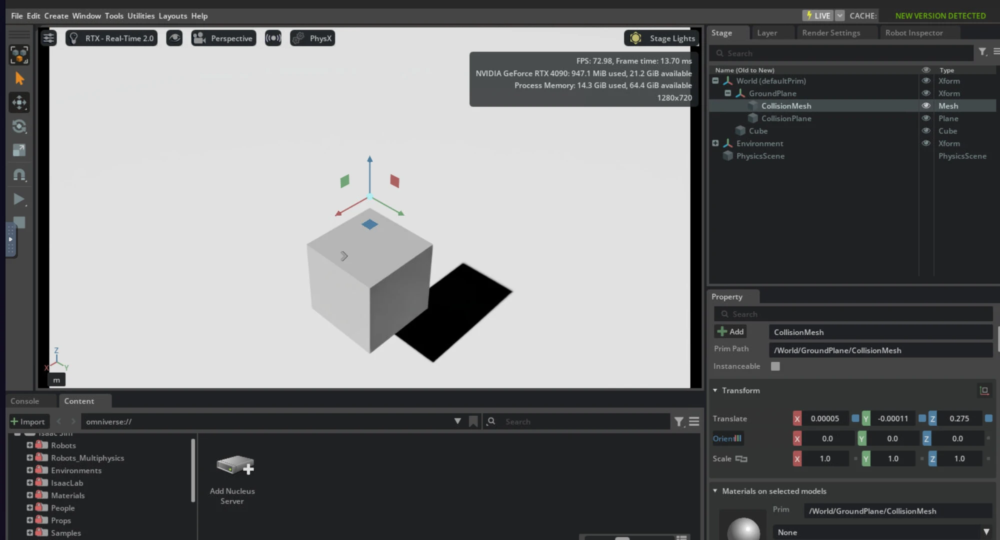
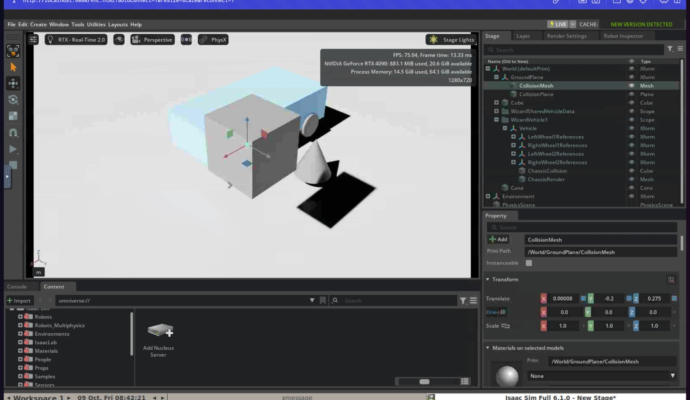

# 프로젝트 리포트: 클라우드 GPU에서 Isaac Sim GUI를 브라우저로 쓰기

> 기간: 2026-10-06 ~ 2026-10-09 · 상태: **환경 구축·검증 완료, 원격 화면 지연 문제로 플랫폼 재검토 중**
> 저장소: [heimer-min/isaac-runpod](https://github.com/heimer-min/isaac-runpod)



*RunPod RTX 4090에서 돌아가는 Isaac Sim 6.1 GUI를 내 노트북 브라우저(noVNC)로 본 화면. RTX Real-Time 렌더러, 서버 측 79 FPS.*

---

## 1. 한눈에 보기

| 항목 | 내용 |
|---|---|
| 문제 | 로컬 GPU 없이 NVIDIA Isaac Sim을 **GUI로 보면서** 학습할 환경이 필요함. 예산 월 3만 원 안팎 |
| 걸림돌 | Isaac Sim 공식 원격 화면(WebRTC)은 UDP가 필요한데, 선택한 클라우드(RunPod)는 TCP/HTTP만 지원 |
| 해결 | Isaac Sim 컨테이너에 가상 디스플레이(Xvfb)와 VNC 스택을 얹은 **커스텀 Docker 이미지**를 만들어 HTTP 하나로 GUI를 전달 |
| 결과 | 브라우저에서 Isaac Sim 6.1 GUI 동작 확인 (RTX 렌더링, 물리 시뮬레이션, SSH 접속) |
| 발견한 한계 | 한국↔유럽 서버 거리 + VNC 방식 때문에 조작 지연이 커서 GUI 위주 학습에는 부적합. 동시에 RunPod 4090 요금이 $0.34 → $0.89로 올라 예산 전제가 무너짐 |
| 다음 단계 | GPU 인코딩 스트리밍(WebRTC)과 가까운 지역을 쓸 수 있는 플랫폼(NVIDIA Brev 등)으로 재평가 |
| 총 클라우드 비용 | 약 $0.9 (검증 세션 2회, 추정치) |

---

## 2. 배경과 요구사항

자율주행 인지(LiDAR, 카메라-LiDAR 캘리브레이션, 센서 퓨전)를 공부하면서, 센서 배치를 바꿔 보고 정답 extrinsic과 비교할 수 있는 시뮬레이터로 Isaac Sim을 선택했다. 로컬 GPU가 없어 클라우드 GPU를 빌려야 했다.

| 요구사항 | 이유 |
|---|---|
| **GUI 필수** | Isaac Sim 입문 단계라 화면을 보며 조작해야 개념이 잡힘. headless만으로는 부족 |
| **월 3만 원 안팎** | 평일 하루 2~3시간, 월 50~60시간 기준 |
| ROS 2 연동 | LiDAR 데이터를 ROS 2 토픽으로 받아 기존 지식과 연결 |

---

## 3. 핵심 결정과 근거

| # | 결정 | 근거 | 이후 검증 결과 |
|---|---|---|---|
| D1 | 플랫폼: **RunPod**, RTX 4090 | 조사 시점 Community 4090 $0.34/hr로 최저가권. 대안 Brev(A10G 온디맨드 약 $1.01/hr)보다 쌌음 | 2026-10-09 기준 $0.89/hr로 인상. 재검토 필요 (§8) |
| D2 | 원격 화면: **noVNC** (WebRTC 포기) | RunPod은 인바운드 UDP를 전달하지 않음. 선행 사례에서 WebRTC는 회색 화면만 뜨는 것이 보고됨 | 동작은 하지만 지연이 큼 (§6 T8) |
| D3 | **커스텀 이미지** (`nvcr.io/nvidia/isaac-sim:6.1.0` 베이스) | pod 자체가 컨테이너라 pod 안에서 `docker run` 불가. 공식 이미지는 uid 1234 비루트 + sudo 없음 → pod 안에서 apt 설치 불가 | 타당 |
| D4 | Isaac Sim **6.1.0** | 조사 시점 최신 GA. 공식 최소 드라이버 595.58.03 | 호스트 드라이버 595.91.07에서 정상 동작 |
| D5 | **Xvfb** (VirtualGL/headless Xorg 미사용) | Isaac Sim은 OpenGL이 아니라 Vulkan을 쓰므로 VirtualGL은 무관. Vulkan이 GPU에서 렌더하고 결과만 X 화면에 출력(present) | 동작. 단 GLX 초기화에서 별도 버그 발생 (§6 T1) |
| D6 | 드라이버 조건을 **템플릿 필터**로 강제 (CUDA 13.2~13.4) | 선행 사례에서 드라이버 580 호스트는 Vulkan이 Xvfb에 출력하지 못해 GUI가 검게 나옴 | 필터 덕분에 두 번 모두 적합한 호스트 배정 |
| D7 | 저장소 전략: **볼륨 없이 매번 terminate** | 네트워크 볼륨은 Secure Cloud 전용. 볼륨 디스크는 정지 중에도 $0.20/GB/월 과금 | 예산상 타당. 대신 매 세션 이미지 pull(약 7분) 발생 |
| D8 | 부팅 시 **호스트 자동 진단** | 같은 GPU라도 호스트마다 드라이버·라이브러리·RAM이 다름. 부적합 호스트는 고치지 말고 바로 재배포하는 게 쌈 | 두 번 모두 진단이 정확히 동작 |

---

## 4. 아키텍처

```
내 노트북 브라우저
   │  HTTPS
   ▼
RunPod HTTP 프록시 (https://<pod-id>-6080.proxy.runpod.net)   ※ 또는 SSH 터널
   │
┌──┴──────────────────────── RunPod pod (컨테이너) ─────────────────────────┐
│  websockify + noVNC  (:6080, 외부에 열린 유일한 웹 포트)                    │
│        │ VNC                                                               │
│  x11vnc (:5901, localhost 전용, 비밀번호)                                  │
│        │                                                                   │
│  Xvfb :1 (가상 디스플레이) + fluxbox(창 관리자)                            │
│        ▲ Vulkan present                                                    │
│  Isaac Sim 6.1 GUI ── RTX 렌더링 ──▶ RTX 4090 (NVIDIA 드라이버 595.91.07)  │
│                                                                            │
│  sshd (:22, 키 인증만) · ROS 2 Jazzy CLI/rviz2 · 진단 스크립트             │
└────────────────────────────────────────────────────────────────────────────┘
```

| 구성 요소 | 역할 |
|---|---|
| Xvfb | 모니터 없는 서버에 가상 화면 생성 |
| x11vnc | 가상 화면을 VNC로 송출. 외부 노출 없이 localhost에서만 받음 |
| websockify / noVNC | VNC를 WebSocket으로 변환하고 브라우저용 뷰어 제공 |
| fluxbox | 창 이동·최대화, 우클릭 메뉴로 터미널 열기 |
| sshd | 디버깅과 파일 전송(scp)용 |
| ROS 2 Jazzy | 같은 컨테이너에서 Isaac의 토픽을 받는 쪽(ros2 CLI, rviz2). 베이스 이미지가 Ubuntu 24.04라 Jazzy가 자동 선택됨 |

---

## 5. 구현

### 5-1. 컨테이너 이미지 ([Dockerfile](../Dockerfile))

| 레이어 | 내용 | 설계 의도 |
|---|---|---|
| 베이스 | `nvcr.io/nvidia/isaac-sim:6.1.0` (NGC 공개 이미지, 로그인 불필요) | |
| `USER root` | 공식 이미지의 비루트 사용자를 빌드 시점에만 root로 전환 | pod 안에서는 설치가 불가능하므로 빌드 때 모두 설치 |
| `NVIDIA_DRIVER_CAPABILITIES=all` | 컨테이너 런타임이 compute뿐 아니라 Vulkan/GLX(graphics) 라이브러리도 주입하게 함 | compute만 주입되면 GUI 불가 |
| 데스크톱 스택 | xvfb, x11vnc, novnc, websockify, fluxbox, xterm, vulkan-tools, mesa-utils, openssh-server | |
| ROS 2 | `/etc/os-release`로 Ubuntu 버전을 읽어 Jazzy(24.04)/Humble(22.04) 자동 선택. `ros2-apt-source` 공식 방식 | 베이스 이미지 버전이 바뀌어도 동작 |
| 스크립트 복사 | **맨 마지막 레이어** | 자주 바뀌는 것을 아래에 둬서 캐시 극대화 → v2 재빌드 **11.8초** |
| ENTRYPOINT | `start.sh` | 공식 이미지의 헤드리스 스트리밍 진입점을 덮어씀 |

**빌드 환경**: Apple Silicon MacBook Air(arm64)에서 `docker buildx --platform linux/amd64`로 교차 빌드 → Docker Hub private 저장소에 push. 이미지 약 10.9GB.

### 5-2. 부팅 스크립트 ([scripts/start.sh](../scripts/start.sh))

부팅 순서 (v2):

1. **자동 terminate 타이머** (가장 먼저: 중간 단계가 실패해도 과금 사고를 막기 위해)
2. EULA 확인: `ACCEPT_EULA=Y`가 없으면 Isaac 자동 실행 안 함 (라이선스 동의를 이미지에 박지 않음)
3. 영속 볼륨이 마운트돼 있을 때만 셰이더·에셋 캐시를 볼륨으로 연결
4. sshd: `PUBLIC_KEY` 환경변수로 키 인증만 허용
5. Xvfb → fluxbox
6. x11vnc: 비밀번호가 없으면 pod마다 무작위 8자 생성, 감시 루프로 자동 재시작
7. websockify/noVNC
8. 호스트 진단 (실패해도 멈추지 않고 경고)
9. Isaac Sim GUI 자동 실행 → 창이 뜰 때까지 대기 후 최대화
10. PID 1 유지

### 5-3. 운영 도구

| 도구 | 기능 |
|---|---|
| [isaac-gui](../scripts/isaac-gui.sh) | `start/stop/restart/status/log`. ROS를 source한 셸에서 실행하면 거부 (내장 ROS 라이브러리와 충돌 방지) |
| [isaac-diag](../scripts/diag.sh) | 드라이버 버전, graphics 라이브러리 주입, Vulkan ICD, **Vulkan이 Xvfb에 출력 가능한지**, RAM(cgroup 제한 포함), /dev/shm, 디스크를 점검. 종료 코드 0/1/2 |
| [fastdds-udp.xml](../config/fastdds-udp.xml) | /dev/shm이 작을 때 Fast DDS를 UDP 전용으로 |

### 5-4. 보안 설계

| 위험 | 대응 |
|---|---|
| 프록시 URL은 pod ID만 알면 누구나 접근 | 외부 웹 포트는 6080 하나. VNC(5901)는 localhost 전용. pod마다 무작위 비밀번호 |
| SSH 무차별 대입 | 비밀번호 로그인 금지, 공개키 인증만 |
| 레지스트리 자격 증명 유출 | **최소 권한**: Mac은 Read & Write 토큰, RunPod은 **Read-only** 토큰을 따로 발급 |
| 라이선스가 걸린 바이너리 재배포 | Isaac Sim이 포함된 이미지는 Docker Hub **private** |
| 비밀값의 저장소 유출 | `.gitignore`로 `.env`, 키 파일 등을 차단. 이미지·템플릿에 비밀값 없음. 커밋 이메일은 GitHub noreply 주소 |
| 잊고 켜 둔 pod의 과금 | `MAX_SESSION_HOURS` 자동 terminate, 선불 크레딧 소액 충전, 자동 충전 끔 |

### 5-5. 개발 인프라 구성 (이 프로젝트에서 처음 세팅한 것)

- git 저장소 생성(`main` 브랜치), `.gitignore` 작성, GitHub noreply 이메일로 커밋 작성자 설정
- ED25519 SSH 키 생성 → GitHub 등록 → 서버 지문을 [공식 값](https://docs.github.com/en/authentication/keeping-your-account-and-data-secure/githubs-ssh-key-fingerprints)과 대조 후 연결
- 같은 공개키를 RunPod에 재사용 (공개키는 여러 곳에 등록해도 안전)
- Docker Hub private 저장소 + 용도별 Personal Access Token
- RunPod: Container Registry Auth, 템플릿(GPU 호환성 필터: CUDA 13.2~13.4, vRAM 24GB, RAM 32GB, RT 코어 없는 A100 계열 제외)

---

## 6. 트러블슈팅 기록

각 항목은 **증상 → 증거 → 원인 → 해결 → 교훈** 순서로 정리했다.

### T1. Xvfb가 시작하자마자 죽음 (Segmentation fault)

- **증상**: 1차 검증에서 `Xvfb ... Aborted (core dumped)`, GUI 스택 전체가 시작 불가
- **증거**: `xvfb.log`의 backtrace를 아래에서 위로 읽음
  ```
  Xvfb InitExtensions → (GLX) swrast_dri.so (Mesa) → libEGL.so.1 (GLVND)
    → libEGL_nvidia.so.0 → libnvidia-egl-gbm.so.1 → Segmentation fault
  ```
- **원인**: Xvfb의 GLX 확장이 Mesa 소프트웨어 렌더러를 쓰려 했지만, 컨테이너에 NVIDIA 그래픽 라이브러리도 함께 주입돼 있어 중개 계층(GLVND)이 **NVIDIA EGL을 선택** → 실제 디스플레이가 없는 Xvfb 안에서 충돌
- **처음 가설과 다름**: 처음엔 `--no-install-recommends`로 글꼴/키맵 패키지가 빠졌다고 추측했으나 로그가 반박
- **해결**: Xvfb 프로세스에만 Mesa EGL을 지정. pod 안에서 먼저 수동 검증한 뒤 이미지에 반영
  ```bash
  setsid env __EGL_VENDOR_LIBRARY_FILENAMES=/usr/share/glvnd/egl_vendor.d/50_mesa.json \
      Xvfb :1 -screen 0 1600x900x24 +extension GLX +render -noreset
  ```
  GLX를 끄는 대안도 있었지만, rviz2(OpenGL)를 살리기 위해 GLX를 유지하는 쪽을 택함
- **교훈**: 추측보다 로그. 수정은 비싼 재빌드 전에 실환경에서 최소 비용으로 먼저 검증

### T2. SSH 공개키가 컨테이너에 전달되지 않음

- **증상**: `PUBLIC_KEY 없음 — sshd 생략`
- **증거**: `env`에 공개키 관련 변수가 전혀 없음
- **원인**: RunPod 문서에 키 전달 변수명이 문서마다 다르게(`PUBLIC_KEY` / `SSH_PUBLIC_KEY`) 적혀 있었고, 실제로는 커스텀 이미지에 환경변수로 전달되지 않음
- **해결**: 템플릿 환경변수에 `PUBLIC_KEY`를 직접 지정 (공개키라 평문 저장 가능)
- **교훈**: 문서가 엇갈리는 지점은 "첫 부팅 확인 포인트"로 미리 지정해 두면 빠르게 판별 가능

### T3. 실패 시 자동 terminate 타이머가 동작하지 않음

- **증상**: T1로 스크립트가 중간에서 대기 상태가 되자, 맨 끝에 있던 타이머가 시작되지 않음 → pod가 자동으로 꺼지지 않는 상태
- **원인**: 안전장치를 정상 경로 끝에 배치한 설계 결함
- **해결**: 타이머 블록을 스크립트 맨 앞으로 이동. v2 로그 첫 줄에서 `자동 terminate 타이머: 1시간` 확인
- **교훈**: 안전장치는 실패 경로에서도 반드시 실행되는 위치에 둔다

### T4. 진단의 오탐 경고 (ICD 검사)

- **증상**: Vulkan 출력은 정상인데 `nvidia_icd.json 못 찾음` 경고
- **원인**: `ls 경로1 경로2`는 **하나라도 없으면 실패 코드**를 반환. "둘 중 하나라도 있으면 OK"라는 의도와 다름
- **해결**: `[ -f 경로1 ] || [ -f 경로2 ]`로 교체 → v2에서 `[OK]`
- **교훈**: 조건문에 쓰는 명령의 종료 코드 의미를 정확히 확인

### T5. Community에 조건 맞는 호스트가 없음

- **증상**: Community + CUDA 13.2 이상 조건에서 4090·3090 모두 Out of capacity (Public IP 조건을 빼도 동일)
- **분석**: 조건을 하나씩 풀어 원인 분리 → CUDA 조건이 병목. Community 호스트는 개인이 운영해 드라이버 갱신이 느린 것으로 추정
- **판단**: CUDA 조건을 풀면 드라이버 580 호스트에서 GUI가 검게 나올 위험이 큼 → 검증 세션만 Secure로 진행. "환경이 동작하는가"와 "자리를 구할 수 있는가"를 분리
- **교훈**: 한 번에 하나의 변수만 바꿔 원인을 분리

### T6. 원격 화면 지연 (해결 못 함 → 플랫폼 재검토의 근거)

- **증상**: Isaac은 서버에서 73~79 FPS로 도는데, 브라우저 조작 반응이 매우 느림
- **실험**:

| 실험 | 내용 | 결과 |
|---|---|---|
| A | noVNC 화질↓ 압축↑ | 개선 없음 → 대역폭 병목 아님 |
| B | RunPod 프록시(Cloudflare)를 우회해 SSH 터널(`ssh -N -L 6080:localhost:6080`)로 접속 | 개선 없음 → 프록시 병목 아님 |
| C | 서버 위치 확인 | **EU-RO-1 (루마니아)**, 한국에서 약 8,000km |

- **결론**: 병목은 ① 물리적 거리(왕복 지연) ② VNC 방식 자체(매 프레임 바뀌는 3D 화면을 CPU로 압축)
- **판단**: 설정으로 해결할 수 없는 구조적 한계. GPU 인코딩 스트리밍(WebRTC) + 가까운 지역이 필요

### 기타 (환경 세팅 중 겪은 것)

| 상황 | 원인 | 배운 것 |
|---|---|---|
| `git log` 결과가 복사하면 사라짐 | 페이저(`less`)가 종료 시 화면을 지움 | `git --no-pager`, `core.pager "less -FRX"` |
| `Cannot connect to the Docker daemon` | Docker Desktop 앱이 꺼져 있음. `docker start`는 컨테이너를 켜는 명령이지 데몬을 켜는 명령이 아님 | CLI(리모컨)와 데몬(엔진)의 구분 |
| Terminate 버튼이 안 보임 | RunPod은 실행 중 pod는 먼저 Stop해야 Terminate 가능 | Stop(저장소 과금 지속 가능)과 Terminate(완전 삭제)의 차이 |

---

## 7. 결과와 측정값

### 검증 항목

| 항목 | 1차 (10-08) | 2차 (10-09, v2) |
|---|---|---|
| private 이미지 pull (레지스트리 인증) | ✅ 약 7분 | ✅ |
| SSH (키 인증) | ❌ T2 | ✅ |
| Xvfb + 호스트 진단 | ❌ T1 (수동 수정 후 ✅) | ✅ 자동, 경고 0 |
| 브라우저에 Isaac Sim GUI | — | ✅ |
| 물리 시뮬레이션 | — | ✅ Rigid Body 낙하, Vehicle Wizard 차량 생성 |
| 자동 terminate | ❌ T3 | 미검증 (조기 수동 종료) |

### 측정값 (2차)

| 지표 | 값 |
|---|---|
| 컨테이너 시작 → Isaac 창 표시 | **25초** (17:17:06 → 17:17:31) |
| Isaac 실행 → 창 표시 | 20초 |
| 렌더링 | RTX Real-Time 2.0, 73~79 FPS, 프레임 12.6~13.7ms (뷰포트 1280×720) |
| GPU 메모리 | 0.7~0.95 GiB 사용 / 24 GiB (빈 씬~간단한 씬) |
| 프로세스 메모리 | 13.5~14.5 GiB |
| 호스트 | RTX 4090 · 드라이버 595.91.07 · AMD EPYC 7352 16 vCPU · RAM 83GB · EU-RO-1 · Ubuntu 24.04 |
| v2 이미지 재빌드 + push | 11.8초 (레이어 캐시) |



*편집 모드(Translate로 이동)와 시뮬레이션 모드(Play 시 중력·충돌 계산)의 차이를 확인한 실습.*



*실험 B: RunPod 프록시를 우회해 `localhost:6080`(SSH 터널)로 접속한 화면. Vehicle Wizard로 차량을 생성했다.*

### 비용

| 세션 | 구성 | 시간 | 비용(추정) |
|---|---|---|---|
| 1차 | Secure 4090 $0.74/hr | 약 25분 | 약 $0.3 |
| 2차 | Secure 4090 $0.89/hr + 저장소 $0.008/hr | 약 40분 | 약 $0.6 |
| **합계** | | | **약 $0.9** |


---

## 8. 한계와 다음 단계

### 확인된 한계

1. **원격 화면 지연**: noVNC + 유럽 서버 조합으로는 GUI 조작 위주 학습이 어려움 (T8)
2. **예산 전제 붕괴**: RunPod 4090이 Community·Secure 모두 $0.89/hr로 표시됨. 월 55시간이면 약 $49 (목표의 2배 이상)
3. **Community 가용성**: CUDA 13.2+ 조건을 만족하는 Community 호스트를 한 번도 확보하지 못함
4. **세션마다 7분 pull**: 볼륨 없는 운영의 대가

### 다음 단계

| 우선순위 | 할 일 |
|---|---|
| 1 | **플랫폼 재평가**: NVIDIA Brev 공식 [Isaac Launchable](https://github.com/isaac-sim/isaac-launchable) (공식 WebRTC 스트리밍, VM이라 정지·재시작 가능). GPU별 가격·지역·정지 중 저장 요금 확인 |
| 2 | 대안: RunPod 아시아 리전, RunPod "Enable UDP port support"로 공식 WebRTC 스트리밍 시도, Vast.ai |
| 3 | 첫 실습 완주: 로봇 임포트 → RTX LiDAR → ROS 2 브리지 → rviz2 ([docs/03](03-first-lab.md)) |
| 4 | 이미지 v3: fluxbox 배경화면 경고 제거, 자동 terminate 검증 |
| 5 | 가이드 문서(02, 04)를 검증 결과로 갱신 |

이미지·스크립트는 RunPod 전용이 아니라서, 플랫폼을 옮겨도 Docker가 되는 GPU 환경이면 그대로 재사용할 수 있다.

---

## 9. 이 프로젝트에서 다룬 기술

| 분야 | 내용 |
|---|---|
| 컨테이너 | 공식 이미지 확장, 레이어 캐시 설계, arm64 → amd64 교차 빌드, private 레지스트리, 컨테이너 PID 1 설계 |
| 리눅스 그래픽 | Xvfb, X11 GLX, Vulkan WSI/present, GLVND 벤더 선택, NVIDIA 컨테이너 런타임의 라이브러리 주입 |
| 원격 접속 | VNC/noVNC/websockify, HTTP 리버스 프록시, SSH 공개키 인증, SSH 로컬 포트 포워딩 |
| 클라우드 운영 | GPU 호스트 필터링(드라이버/CUDA), Secure vs Community 비교, 스토리지 과금 구조, 비용 안전장치 |
| 보안 | 최소 권한 토큰, 노출 포트 최소화, 비밀값 관리, 노출 사고 대응 |
| 디버깅 | backtrace 분석, 변수 하나씩 바꾸는 원인 분리, 실환경 사전 검증 후 반영 |
| 시뮬레이션 | Isaac Sim 6.1 기본 조작, USD Stage/Prim, PhysX Rigid Body·Collider |
| 협업 도구 | git(스테이징, 커밋 메시지 관례, 원격 저장소), GitHub SSH |

---

## 10. 참고 자료

- Isaac Sim 요구사항(6.x, 드라이버 595.58.03): https://docs.isaacsim.omniverse.nvidia.com/latest/installation/requirements.html
- Isaac Sim 컨테이너 설치: https://docs.isaacsim.omniverse.nvidia.com/6.0.1/installation/install_container.html
- Isaac Sim Brev 배포: https://docs.isaacsim.omniverse.nvidia.com/6.1.0/installation/install_advanced_cloud_setup_brev.html
- Isaac Launchable: https://github.com/isaac-sim/isaac-launchable
- NGC Isaac Sim 이미지: https://catalog.ngc.nvidia.com/orgs/nvidia/containers/isaac-sim/tags
- CUDA ↔ 드라이버 브랜치: https://docs.nvidia.com/cuda/cuda-toolkit-release-notes/index.html
- RunPod 요금: https://www.runpod.io/pricing
- RunPod 네트워크 볼륨: https://docs.runpod.io/storage/network-volumes
- RunPod SSH: https://docs.runpod.io/pods/configuration/use-ssh
- RunPod 자격 증명: https://docs.runpod.io/get-started/credentials
- RunPod pod 관리: https://docs.runpod.io/pods/manage-pods
- 선행 사례: RunPod noVNC (Isaac 4.0): https://github.com/Sa3d-99/runpod_noVNC_isaac_sim
- 선행 사례: Isaac 6.1 + Xvfb, 드라이버 580 이슈: https://github.com/romoya-robotics/isaac-cloud
- Docker Hub 토큰: https://docs.docker.com/security/access-tokens/personal-access-tokens/
- GitHub SSH 키: https://docs.github.com/en/authentication/connecting-to-github-with-ssh
